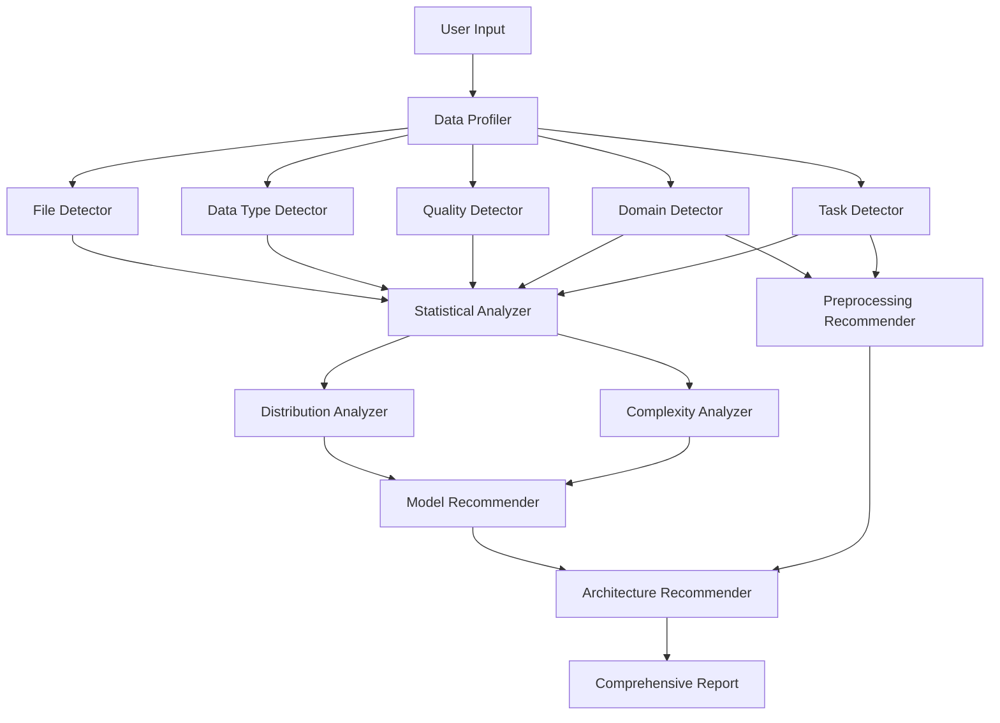

# Design Document

## Overview

Neurolite is designed as a modular, extensible library that provides intelligent data detection and automated ML pipeline recommendations. The architecture follows a layered approach with specialized detectors, analyzers, and recommenders that work together to provide comprehensive data insights with minimal user input.

The system processes data through a pipeline of detection phases: file format identification → data structure analysis → feature characterization → quality assessment → statistical analysis → domain-specific detection → ML task identification → model recommendation.

## Architecture

The system follows a modular architecture with clear separation of concerns:



### Core Components

1. **Data Profiler**: Central orchestrator that coordinates all detection and analysis phases
2. **Detector Modules**: Specialized components for different aspects of data detection
3. **Analyzer Modules**: Statistical and complexity analysis components
4. **Recommender Modules**: ML model and preprocessing recommendation engines
5. **Result Aggregator**: Combines all analysis results into a unified report

## Components and Interfaces

### Core Interface

```python
class DataProfiler:
    def analyze(self, data_source: Union[str, pd.DataFrame, np.ndarray]) -> ProfileReport
    def quick_analyze(self, data_source: Union[str, pd.DataFrame, np.ndarray]) -> QuickReport
```

### Detector Components

#### FileDetector
- **Purpose**: Identifies file formats and basic structure
- **Methods**: 
  - `detect_format(file_path: str) -> FileFormat`
  - `detect_structure(data) -> DataStructure`
- **Dependencies**: python-magic, pandas, PIL, librosa
- **Output**: FileFormat enum, confidence score, structure type

#### DataTypeDetector  
- **Purpose**: Classifies column types and feature characteristics
- **Methods**:
  - `classify_columns(df: pd.DataFrame) -> Dict[str, ColumnType]`
  - `analyze_numerical(series: pd.Series) -> NumericalAnalysis`
  - `analyze_categorical(series: pd.Series) -> CategoricalAnalysis`
  - `analyze_temporal(series: pd.Series) -> TemporalAnalysis`
- **Dependencies**: pandas, numpy, dateutil
- **Output**: Column type classifications, cardinality, distribution hints

#### QualityDetector
- **Purpose**: Assesses data quality and identifies issues
- **Methods**:
  - `detect_missing_patterns(df: pd.DataFrame) -> MissingDataAnalysis`
  - `find_duplicates(df: pd.DataFrame) -> DuplicateAnalysis`
  - `validate_consistency(df: pd.DataFrame) -> ConsistencyReport`
- **Dependencies**: pandas, numpy
- **Output**: Quality metrics, missing data classification, imputation recommendations

#### DomainDetector
- **Purpose**: Identifies domain-specific data patterns
- **Methods**:
  - `detect_cv_task(data) -> CVTaskType`
  - `detect_nlp_task(data) -> NLPTaskType`
  - `detect_timeseries_characteristics(data) -> TimeSeriesAnalysis`
- **Dependencies**: opencv-python, transformers, statsmodels
- **Output**: Domain-specific task identification, format specifications

#### TaskDetector
- **Purpose**: Identifies ML task types and complexity
- **Methods**:
  - `detect_supervised_task(X, y) -> SupervisedTask`
  - `detect_unsupervised_potential(X) -> UnsupervisedTask`
  - `assess_complexity(X, y) -> ComplexityMetrics`
- **Dependencies**: scikit-learn, numpy
- **Output**: Task type classification, complexity assessment

### Analyzer Components

#### StatisticalAnalyzer
- **Purpose**: Performs comprehensive statistical analysis
- **Methods**:
  - `analyze_distributions(df: pd.DataFrame) -> DistributionAnalysis`
  - `compute_correlations(df: pd.DataFrame) -> CorrelationMatrix`
  - `detect_relationships(df: pd.DataFrame) -> RelationshipAnalysis`
- **Dependencies**: scipy, scikit-learn, pandas
- **Output**: Distribution parameters, correlation matrices, relationship insights

#### DistributionAnalyzer
- **Purpose**: Specialized distribution fitting and analysis
- **Methods**:
  - `fit_distributions(series: pd.Series) -> List[DistributionFit]`
  - `test_normality(series: pd.Series) -> NormalityTest`
  - `detect_multimodal(series: pd.Series) -> MultimodalAnalysis`
- **Dependencies**: scipy.stats, numpy
- **Output**: Best-fit distributions, goodness-of-fit metrics, distribution parameters

#### ComplexityAnalyzer
- **Purpose**: Assesses dataset and modeling complexity
- **Methods**:
  - `assess_dataset_complexity(X, y) -> DatasetComplexity`
  - `estimate_resource_requirements(X, y) -> ResourceEstimate`
  - `predict_overfitting_risk(X, y) -> OverfittingRisk`
- **Dependencies**: scikit-learn, psutil
- **Output**: Complexity metrics, resource estimates, risk assessments

### Recommender Components

#### ModelRecommender
- **Purpose**: Recommends appropriate ML models and algorithms
- **Methods**:
  - `recommend_traditional_ml(task_info: TaskInfo) -> List[ModelRecommendation]`
  - `recommend_deep_learning(task_info: TaskInfo) -> List[DLRecommendation]`
  - `rank_recommendations(recommendations: List) -> RankedRecommendations`
- **Dependencies**: scikit-learn, meta-learning database
- **Output**: Ranked model recommendations with rationale

#### PreprocessingRecommender
- **Purpose**: Suggests preprocessing steps and transformations
- **Methods**:
  - `recommend_scaling(numerical_analysis: NumericalAnalysis) -> ScalingRecommendation`
  - `recommend_encoding(categorical_analysis: CategoricalAnalysis) -> EncodingRecommendation`
  - `recommend_feature_engineering(data_analysis: DataAnalysis) -> FeatureEngineering`
- **Dependencies**: scikit-learn, feature-engine
- **Output**: Preprocessing pipeline recommendations

#### ArchitectureRecommender
- **Purpose**: Recommends specific model architectures for deep learning
- **Methods**:
  - `recommend_cnn_architecture(cv_analysis: CVAnalysis) -> CNNArchitecture`
  - `recommend_rnn_architecture(sequence_analysis: SequenceAnalysis) -> RNNArchitecture`
  - `recommend_transformer_config(nlp_analysis: NLPAnalysis) -> TransformerConfig`
- **Dependencies**: Domain-specific architecture templates
- **Output**: Detailed architecture specifications

## Data Models

### Core Data Models

```python
@dataclass
class FileFormat:
    format_type: str
    confidence: float
    mime_type: str
    encoding: Optional[str]
    metadata: Dict[str, Any]

@dataclass
class DataStructure:
    structure_type: Literal['tabular', 'time_series', 'image', 'text', 'audio', 'video']
    dimensions: Tuple[int, ...]
    sample_size: int
    memory_usage: int

@dataclass
class ColumnType:
    primary_type: Literal['numerical', 'categorical', 'temporal', 'text', 'binary']
    subtype: str
    confidence: float
    properties: Dict[str, Any]

@dataclass
class QualityMetrics:
    completeness: float
    consistency: float
    validity: float
    uniqueness: float
    missing_pattern: str
    duplicate_count: int

@dataclass
class StatisticalProperties:
    distribution: str
    parameters: Dict[str, float]
    correlation_matrix: np.ndarray
    feature_importance: Dict[str, float]
    outlier_indices: List[int]

@dataclass
class TaskIdentification:
    task_type: str
    task_subtype: str
    complexity: str
    confidence: float
    characteristics: Dict[str, Any]

@dataclass
class ModelRecommendation:
    model_name: str
    model_type: str
    confidence: float
    rationale: str
    hyperparameters: Dict[str, Any]
    expected_performance: Dict[str, float]

@dataclass
class ProfileReport:
    file_info: FileFormat
    data_structure: DataStructure
    column_analysis: Dict[str, ColumnType]
    quality_metrics: QualityMetrics
    statistical_properties: StatisticalProperties
    domain_analysis: Dict[str, Any]
    task_identification: TaskIdentification
    model_recommendations: List[ModelRecommendation]
    preprocessing_recommendations: List[str]
    resource_requirements: Dict[str, Any]
    execution_time: float
```

## Error Handling

### Error Categories

1. **Input Validation Errors**: Invalid file paths, unsupported formats, corrupted data
2. **Processing Errors**: Memory limitations, computation timeouts, analysis failures
3. **Configuration Errors**: Missing dependencies, invalid parameters
4. **Resource Errors**: Insufficient memory, disk space, processing power

### Error Handling Strategy

```python
class NeuroLiteException(Exception):
    """Base exception for NeuroLite library"""
    pass

class UnsupportedFormatError(NeuroLiteException):
    """Raised when file format is not supported"""
    pass

class InsufficientDataError(NeuroLiteException):
    """Raised when dataset is too small for analysis"""
    pass

class ResourceLimitError(NeuroLiteException):
    """Raised when resource limits are exceeded"""
    pass
```

### Graceful Degradation

- If specific detectors fail, continue with available analysis
- Provide partial results with confidence indicators
- Log warnings for failed components
- Offer alternative analysis methods when primary methods fail

## Testing Strategy

### Unit Testing
- Individual detector component testing
- Statistical analysis validation against known datasets
- Model recommendation accuracy testing
- Performance benchmarking for each component

### Integration Testing
- End-to-end pipeline testing with various data types
- Cross-component interaction validation
- Error propagation and handling testing
- Resource usage monitoring

### Performance Testing
- Large dataset processing (up to 1GB target)
- Memory usage profiling
- Processing time benchmarking
- Concurrent analysis testing

### Validation Testing
- Accuracy validation against manually labeled datasets
- Domain expert validation for recommendations
- Cross-validation of statistical analyses
- Comparison with existing tools (pandas-profiling, AutoML libraries)

### Test Data Strategy
- Synthetic datasets for controlled testing
- Public benchmark datasets for validation
- Edge case datasets (empty, single column, highly correlated features)
- Domain-specific test datasets (images, text, time series)

The design emphasizes modularity, extensibility, and performance while maintaining the simplicity of the user interface. Each component can be developed and tested independently, and the system can gracefully handle failures in individual components while still providing valuable insights from successful analyses.